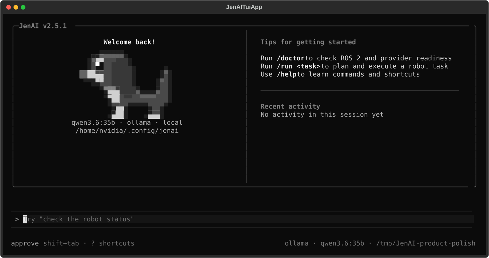
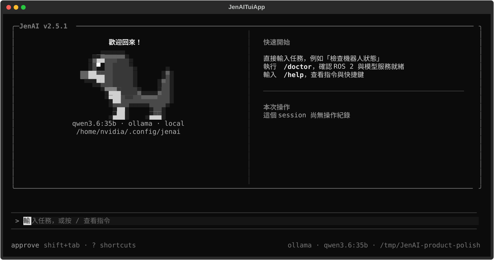
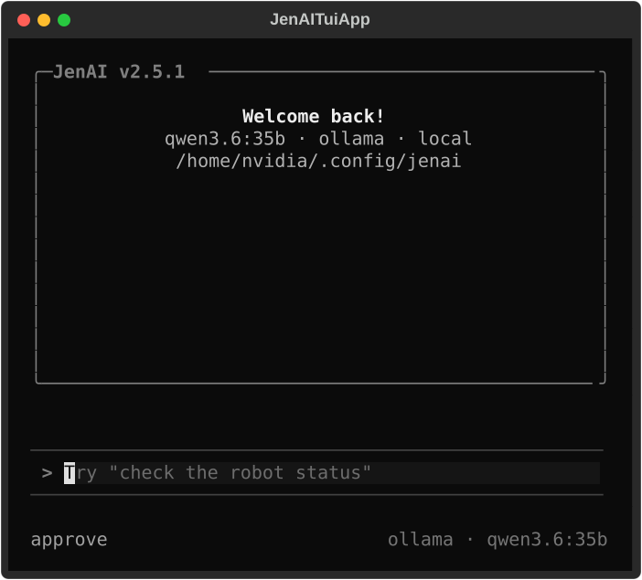
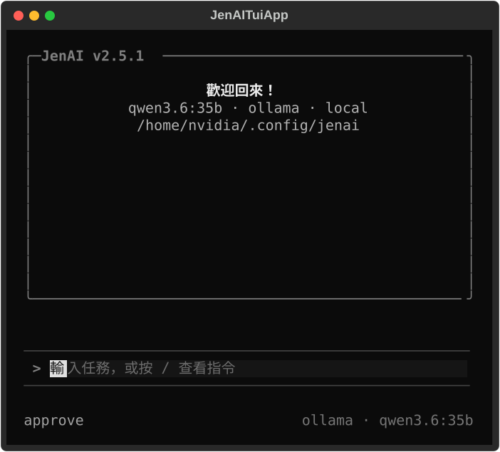
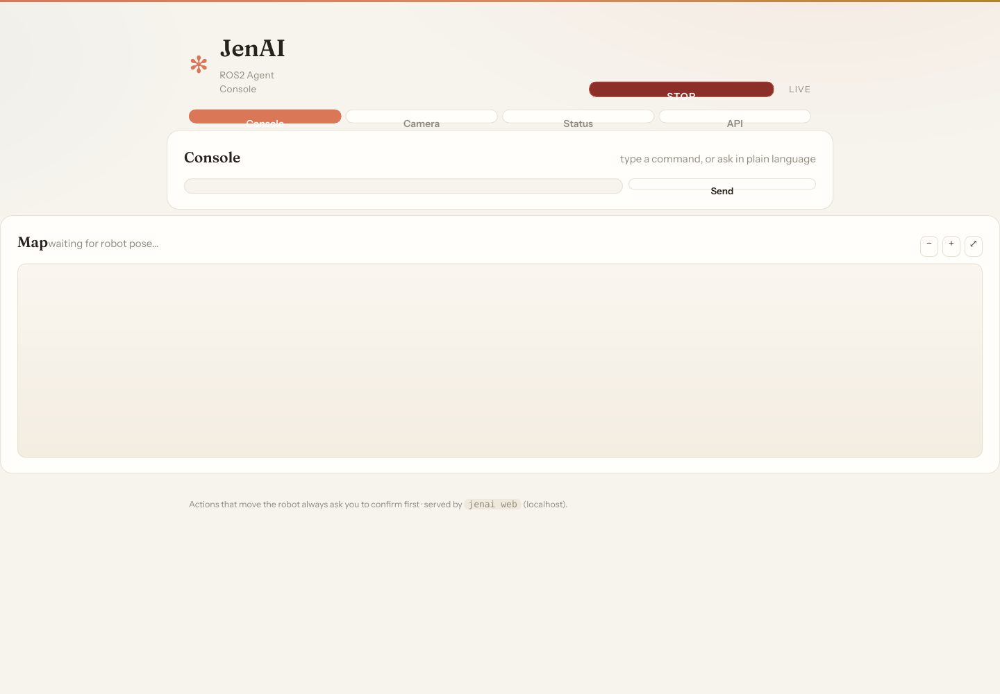
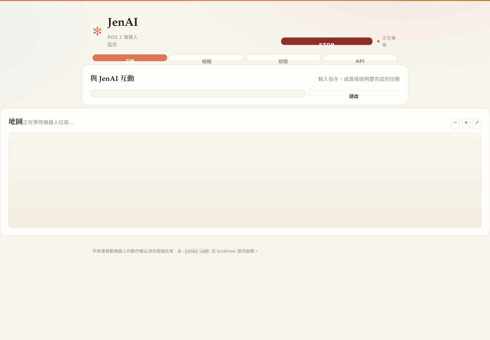
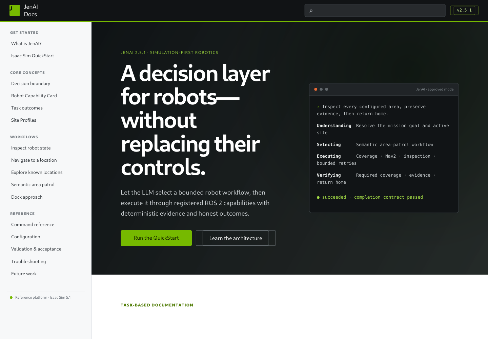
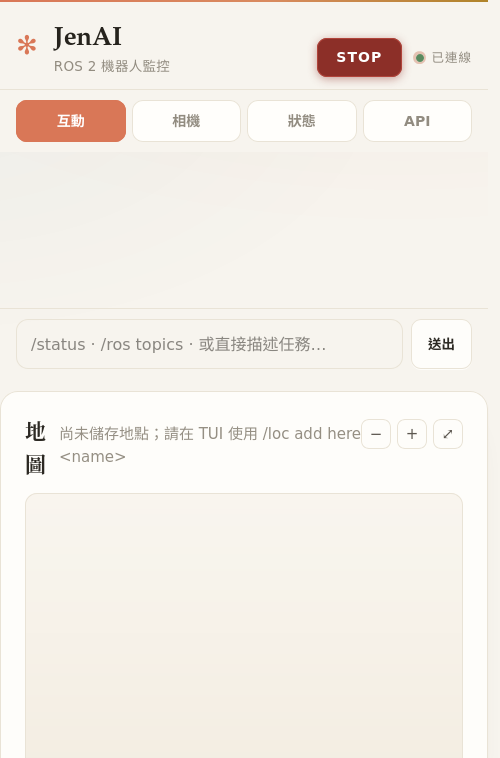
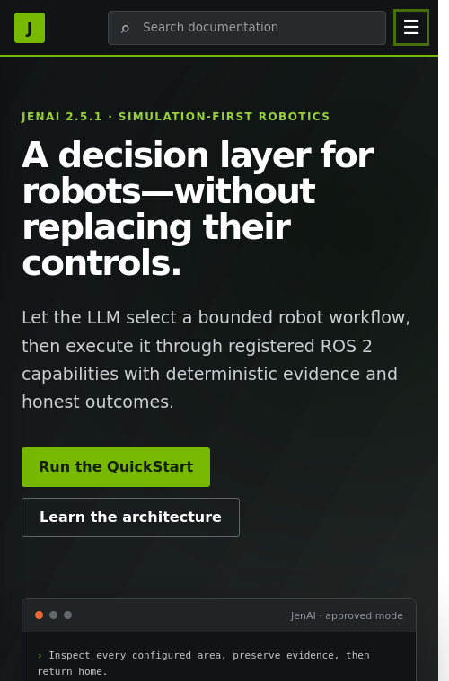

# JenAI Product Polish UI Review

> Review date: 2026-07-30
> Scope: first-run setup, the approved Claude Code-style TUI, the auxiliary WebUI, and the
> documentation website. This is engineering usability evidence, not a user study.

## Design contract

- The TUI remains the terminal-first primary interaction surface.
- The approved transcript layout, dachshund mascot, composer, approval hierarchy, colours, and
  responsive breakpoints are unchanged.
- The WebUI remains an auxiliary monitoring and approval surface; it does not replace the TUI or
  create a second robot execution path.
- No Nav2 algorithm, AMCL parameter, arrival tolerance, endpoint recovery, Capability, TUI motion
  path, or dependency changed. WebUI confirmation cancellation and STOP lifecycle semantics did
  change and therefore require targeted live acceptance before merge.

## Rendered before / after

The TUI images below are real Textual `export_screenshot()` renders from `origin/main` and this
branch. They use the same deterministic provider fixture and viewport.

### Wide terminal — 120 × 30

| Before | After |
|---|---|
|  |  |

### Narrow terminal — 56 × 24

| Before | After |
|---|---|
|  |  |

The WebUI and documentation website images below are rendered from their real production HTML and
CSS at a fixed 1440 × 1000 viewport. Keyboard interaction and the narrow responsive layout were
separately exercised in real headless Firefox through WebDriver. Firefox received a 390 × 844
outer-window request and reported a 500 × 758 effective inner viewport for this run; the manifest and
browser screenshots are preserved
beside these images. Inspectable WebUI documents are also preserved as
[before](evidence/product-polish/webui-before.html) and
[after](evidence/product-polish/webui-after.html).

### Auxiliary WebUI — desktop

| Before | After |
|---|---|
|  |  |

### Documentation website — desktop

| Before | After |
|---|---|
|  |  |

### Real-browser narrow acceptance — measured 500 × 758 inner viewport

| Auxiliary WebUI | Documentation website |
|---|---|
|  |  |

The real-browser gate executed the same event handlers shipped to users:

- WebUI `/` palette: typing, `ArrowDown`, `Tab` completion, and focus retention.
- WebUI tabs: `ArrowRight` and `End` both activate and focus the expected tab.
- Website search: typed query, `ArrowDown`, and `Escape` with combobox focus retained.
- Website mobile menu: `Enter` toggles `aria-expanded` and opens the navigation.
- Both narrow layouts: document width and the primary interaction region remain inside the viewport.

Machine-readable results: [browser-acceptance.json](evidence/product-polish/browser-acceptance.json).

## First useful task checklist

| Journey | Expected user experience | Evidence |
|---|---|---|
| First launch | Three short steps; an invalid field explains what to fix without discarding earlier answers | `test_setup_ux.py` |
| Setup complete | Shows the real config and locations paths, then leads to `JenAI doctor` and `JenAI` | `test_setup_ux.py` |
| TUI welcome | Leads with a natural-language task, then `/doctor` and `/help`; the approved visual layout stays intact | wide/narrow renders and `test_tui_ux_copy.py` |
| Discover a command | `/` opens the palette; keyboard navigation and descriptions use operator language | `test_tui.py`, `test_tui_command_dispatch.py` |
| Approve motion | Risk and physical effect are explicit; options remain one-time, session, or reject; `Esc` rejects | `test_tui_ux_copy.py`, approval-policy tests |
| Web monitor | Current task, pending approvals, tool timeline, and current-service run history survive browser refresh; exact redacted action parameters remain visible and digest-bound before approval | `test_webui.py`, `test_webui_ux.py` |
| Web command fails | Input is restored, but response loss is reported as unknown delivery and tells the operator to inspect state before retrying | `test_webui_ux.py` |
| Web stop is ambiguous | The UI says stop delivery is unconfirmed and directs the operator to the physical emergency stop | `test_webui_ux.py` |
| Website discovery | Search and mobile navigation respond to real keyboard events in Firefox | `ui_browser_acceptance.py`, browser acceptance manifest |

## Verification

- Python format, lint, strict type check: pass.
- Full Python suite: pass.
- Website TypeScript check and production build: pass.
- Website rendered-output and stylesheet regressions: pass.
- Generated WebUI JavaScript syntax check: pass.
- Firefox WebDriver keyboard and measured 500 × 758 inner-viewport responsive acceptance: pass.
- No physical NXDog motion was run or claimed. WebUI confirmation cancellation and STOP lifecycle
  are production action-lifecycle changes; a targeted WebUI → Isaac STOP acceptance is required and
  must be recorded before merge. Unit and concurrency tests do not replace that live evidence.
