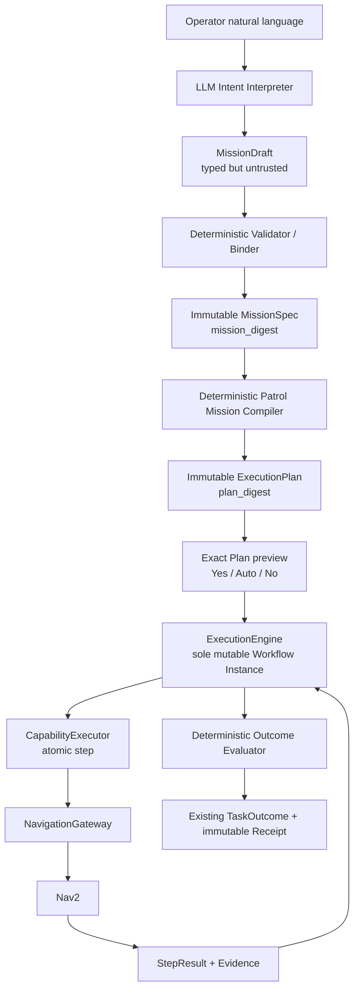

# JenAI Golden Path Core Spec

Status: Product contract for EPIC-0003

## Product promise

```text
自然語言
→ Mission
→ exact Execution Plan
→ Yes / Auto / No
→ deterministic execution
→ Nav2
→ verified TaskOutcome
→ Receipt
```

The first and only v1 Mission kind is a fixed Patrol Mission. Generic Mission DSLs, additional Mission
kinds, semantic inspection coverage, and transport migration are not prerequisites.

## Responsibility flow



`ExecutionEngine` is the immediate single execution-owner role. ADR 0006 remains the future direction
for one cross-interface Robot Runtime Authority. A future Authority may contain this engine; it must not
create a second mutable lifecycle. Durable Events, startup reconciliation, and HTTP／SSE are not required.

## Canonical Mission contract

The Intent Interpreter may produce only a `MissionDraft`. A deterministic Validator／Binder resolves it
into an immutable `MissionSpec`; only that spec may be compiled.

```text
kind                    = patrol
site_profile            = exact active profile identity
robot_profile           = exact active profile identity
operator_waypoints      = [A, B, C]
system_return_home      = Dock
waypoint_retry_limit    = 1
waypoint_failure_policy = skip_and_continue
system_failure_policy   = abort
position_tolerance_m    = 0.15
require_yaw             = false
capture_photo           = false
```

The LLM may select the registered Mission and locations. It may not invent coordinates, add non-policy
steps, choose Nav2 recovery behavior, or modify the bound tolerance.

### Identity and digest rules

- `mission_id` is unique execution identity and is excluded from semantic `mission_digest`.
- `mission_digest` covers semantic Mission content, profiles, locations, policies, and completion.
- The compiler produces exactly `Navigate(A) → Navigate(B) → Navigate(C) → ReturnHome(Dock)`.
- `plan_digest` covers ordered steps and every execution-relevant bound field.
- Receipt preserves `mission_id`, `mission_digest`, and `plan_digest`.

## Approval contract

```text
Plan
1. Navigate to A
2. Navigate to B
3. Navigate to C
4. Return to Dock

Execute? [y] Yes once  [a] Auto  [n] No
```

- `Yes` binds one use of `mission_id + plan_digest + approval epoch`.
- `Auto` matches only the same `plan_digest`, robot, site, session, and safety epoch. It expires on
  restart, STOP, epoch advance, profile change, or runtime uncertainty.
- `No` performs no effectful step.
- Any Plan change requires a new digest and approval.

## Execution, failure, and STOP

`ExecutionEngine` is the only owner of mutable step progress. It calls the existing
`CapabilityExecutor → NavigationGateway → Nav2` path. JenAI does not implement local planning,
obstacle avoidance, or publish `/cmd_vel`.

- waypoint-local failure: retry once, then mark skipped and continue;
- navigation-system failure: abort; return home only when a new command is positively known safe;
- missing Evidence: never claim success.

STOP does not consult the LLM:

```text
ExecutionEngine.stop()
→ prevent next step and invalidate active dispatch
→ CapabilityExecutor.cancel()
→ NavigationGateway cancel / halt
```

Delayed Nav2 success after STOP is diagnostic Evidence only and cannot overwrite terminal truth.

## Completion and outcome

Each navigation step requires Nav2 terminal Evidence plus a fresh endpoint observation within `0.15 m`.
Yaw is disabled for v1. Return Home verifies only the Dock pose and does not claim charging.

Results map to the existing `TaskOutcome`: `succeeded`, `partial`, `endpoint_mismatch`, `blocked`,
`unavailable`, or `failed`. `interrupted` remains lifecycle state; no second outcome enum is added.

Every operator error states what happened, the affected and completed steps, JenAI's next action, and an
evidence-based remedy. A traceback is diagnostic data, not the operator message.

## Validation gate

Automated tests cover draft rejection, deterministic binding and compilation, digest stability,
`Yes / Auto / No`, retry／skip, system abort, STOP, late success, endpoint mismatch, Receipt binding,
and Traditional Chinese messages.

The fixed Isaac scenario must complete three consecutive times on the same commit／scene／profile before
merge. A release claim requires 5/5. Invalid runs do not count and are not repaired by loosening Nav2,
AMCL, tolerance, or frozen acceptance gates.

## Explicit non-goals

- no generic Mission framework, arbitrary DSL, plugins, or other Mission kind;
- no Semantic Area, camera／VLM, coverage, Delivery, Escort, Inventory, or NXDog work;
- no durable Event Store, startup reconciliation, HTTP／SSE, or UI rewrite prerequisite;
- no Nav2／AMCL control change or frozen infrastructure expansion.
