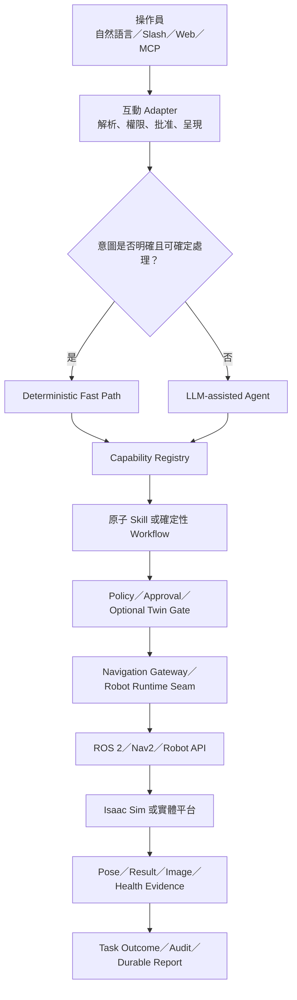
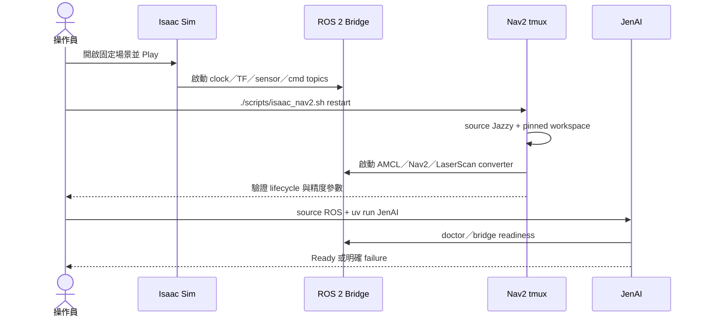
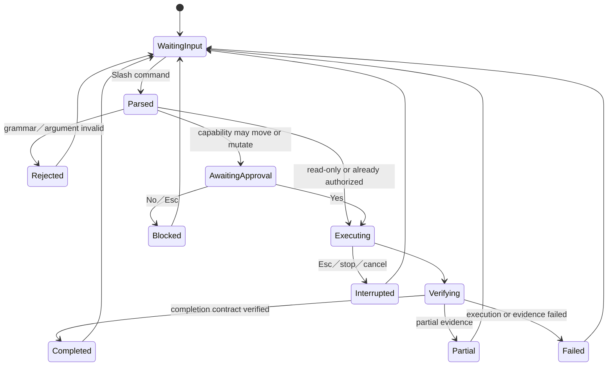
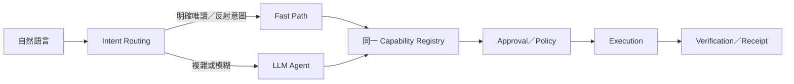
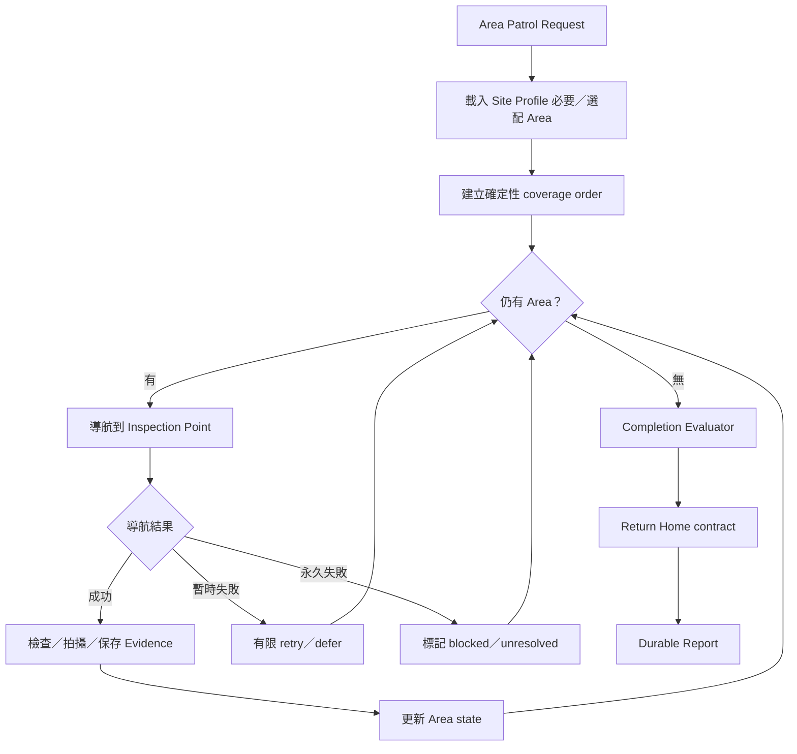
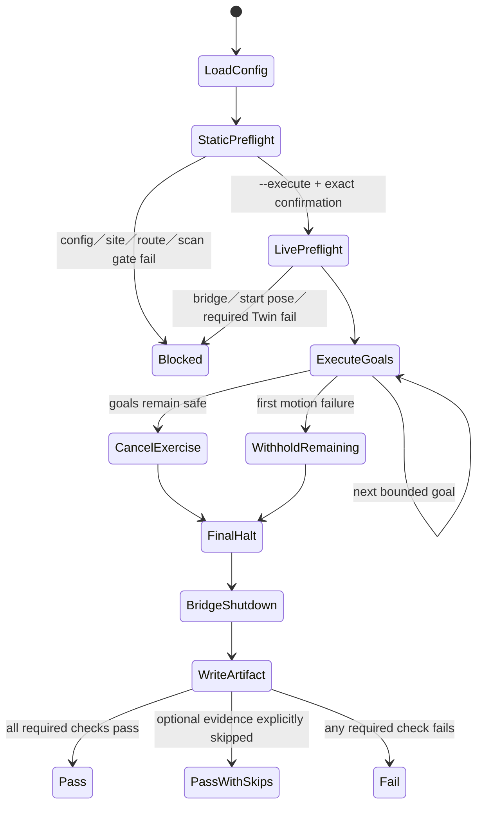

# JenAI 現行 Runtime Workflow

> 適用版本：v2.6.0
>
> 目的：說明「整個系統如何運作」，供新進工程師與資深機器人工程師進行 Design Review。
> 本文件不是逐檔程式碼導覽；逐檔閱讀請見 [CODE_TOUR](../CODE_TOUR.md)。
> 可直接重播的 DGX Spark 操作見
> [CURRENT_ISAAC_TUI_RUNBOOK](../operations/CURRENT_ISAAC_TUI_RUNBOOK.md)；各主張的
> enforcement 狀態見
> [WORKFLOW_EVIDENCE_MATRIX](../validation/WORKFLOW_EVIDENCE_MATRIX.md)。

## 1. 系統定位與責任邊界

JenAI 是高階機器人決策與 Workflow Agent。它負責理解操作員意圖、選擇已註冊的
Capability、監督任務並誠實回報可觀察結果。它不取代 Nav2、車體控制器、即時避障、
定位或硬體安全系統。



| 層級 | 負責決定 | 不負責 |
|---|---|---|
| LLM-assisted Agent | 任務意圖、Capability 選擇、未解高階事件 | 速度、轉向、路徑追蹤、逐點 retry |
| Deterministic Workflow | 正常順序、coverage、有限重試、取消、返航、完成判定 | 開放式語意理解、底層控制 |
| Navigation Gateway／ROS Adapter | 將 typed request 轉成 Nav2／Robot API 並回收證據 | 改寫使用者意圖、宣告無證據成功 |
| Nav2／Robot Controller | 路徑、局部控制、避障與運動學 | 任務目的、巡檢策略、語意回報 |
| 操作員 | 啟動模擬、必要批准、實體安全與人工接管 | 代替系統偽造成功證據 |

## 2. DGX Spark／Isaac Sim 啟動序列

現行部署在 DGX Spark 本機執行 Codex CLI、JenAI、ROS 2 Jazzy、Nav2 與 Isaac Sim。
手機 App／NoMachine 只提供遠端操作與觀察，不是額外的控制 runtime。



| 動作 | 必要條件 |
|---|---|
| 啟動 Nav2 | Isaac Sim 場景存在、Jazzy 與 pinned workspace 可 source、map/params 存在 |
| 接受導航 | `/clock` 前進、TF 可用、定位健康、Nav2 action available、起點合法 |
| 使用儲存地點 | active Site Profile 的 map identity 與 locations identity 相符 |
| 宣告導航完成 | Nav2 terminal result 與最終 pose 同時符合 completion contract |
| 宣告 Dock 完成 | 只能證明抵達 Dock Approach pose；沒有充電回授時為 `arrived_unverified` |

## 3. Replay 與 Nav2 restart

Stop／Play 是「重設模擬世界」，不是每次測試的固定儀式。

符合以下條件時不必 Replay：車輛未卡牆、`/clock` 持續前進、AMCL／TF 合理、沒有殘留
Nav2 goal，而且不是要求相同起點的正式基準。此時依需求先 `/dock`，再執行：

```bash
./scripts/isaac_nav2.sh restart
```

只有車輛卡牆／穿模、模擬時間重設、定位明顯漂移、舊 goal 可能恢復，或正式 HIL 要求
相同 Dock 起點時才 Replay。Replay 後必須 restart Nav2，避免舊 lifecycle、AMCL、costmap
與 sim-time 狀態殘留。

上述條件的可操作判斷表、Owner 與完整命令以
[CURRENT_ISAAC_TUI_RUNBOOK](../operations/CURRENT_ISAAC_TUI_RUNBOOK.md) 為準。本文件只
描述產品流程，不把人工 Replay 政策誤寫成 runtime 已自動偵測。

## 4. TUI 指令與批准 Workflow

明確 Slash 指令走 deterministic command dispatcher，不需要 LLM 重新理解命令。



批准卡有兩個來源，但共用同一 lifecycle：deterministic Slash command 建立的直接批准，
以及 LLM Agent tool call 暫停後建立的 SDK interruption。批准只授權已顯示的 Capability
與參數；拒絕會完成為 `blocked`，不執行動作。緊急停止會先拒絕所有 pending approval，
避免舊批准卡在停止後恢復移動。

### 自然語言



- 明確唯讀請求可走 Fast Path，降低本地大型模型延遲。
- 開放式任務仍可由 LLM 思考，但模型只能選擇註冊 Capability。
- LLM 選定 Workflow 後，正常導航、retry、coverage 與返航不再逐步呼叫 LLM。
- 未解的高階異常才重新進入 Agent Path。

## 5. 主要 Capability Workflow

### 唯讀狀態檢查

```text
request → deterministic intent route → pose／scan／Nav2 snapshot
        → fixed, evidence-grounded summary → audit
```

不需要批准、不移動、不依賴 LLM。

### 單點導航與 Dock Approach

```text
target → active site/location/map validation → approval → optional Twin Gate
       → Navigation Gateway → Nav2 NavigateToPose → terminal result
       → final pose verification → task receipt
```

若 Nav2 回報成功但終點超出設定容差，結果是 endpoint mismatch／failed，而不是成功。
必要時 Navigation Gateway 可執行有限次 endpoint recovery；每次嘗試和最終證據都要保留。

### Semantic Area Patrol



這是「語意區域與觀察點覆蓋」，不是未知地圖的 frontier exploration，也不是掃地機器人的
幾何面積覆蓋。使用者只需指定高階巡邏目標，不必逐點 A→B→C。

### 緊急停止

```text
TUI／WebUI／MCP／daemon／明確自然語言
→ deterministic emergency intent
→ 拒絕所有 pending approvals
→ cancel active Nav2 goal
→ bounded zero command／acknowledgement
→ terminal outcome＋audit
```

停止不依賴 LLM、不需要批准，也不因 provider unavailable 而失效。

## 6. 任務結果與證據

程序的 `completed` 只代表 run 已終止；產品結果另由 Task Outcome 表示：

| Outcome | 意義 |
|---|---|
| `succeeded` | completion contract 已由證據完整驗證 |
| `arrived_unverified` | 抵達 approach pose，但無法觀察最終物理效果 |
| `partial` | 只完成部分必要工作 |
| `endpoint_mismatch` | 執行結束但終點超出容差 |
| `blocked` | policy、前置條件或批准阻止執行 |
| `unavailable` | 必要 Capability／dependency 不可用 |
| `failed` | 執行或驗證失敗 |
| `cancelled` | 操作員或系統取消 |

證據可包括 Nav2 goal/result、AMCL pose、LaserScan、影像、controller 狀態、coverage、
cancel acknowledgement 與 charging signal。不存在的證據不得由 LLM 或文字摘要補造。

## 7. 正式 Isaac HIL 狀態機

正式 live regression 不透過 TUI 或自然語言，而是直接使用相同 Navigation Gateway。



無論中途成功、失敗或拋出例外，`finally` 都必須執行 final halt 與 bridge shutdown，並將
結果寫入 artifact。第一個 motion failure 會 withholding 後續 goal，避免繼續移動不可信
狀態的車輛。

## 8. 測試線與 PASS 定義

| 測試線 | 驗證內容 | 不能證明 |
|---|---|---|
| Unit／architecture | 純 domain invariant、依賴方向、錯誤分類 | ROS graph、車輛移動 |
| Textual headless | TUI focus、批准、queue、取消、呈現 | Isaac Sim／Nav2 live |
| Agent routing | 自然語言選擇與參數 | 導航完成 |
| Live Isaac HIL | 真 ROS 2／Nav2／Isaac、終點、取消、停止 | 實體安全、跨平台、充電 |
| Full TUI acceptance | 真 UI、模型、批准、Capability 與 live runtime | 未測場域泛化 |

Live navigation PASS 至少需要：必要 preflight gate 通過；記錄 Git SHA、設定 fingerprint
與 environment；Nav2 terminal result 符合預期；最終位置與朝向誤差符合 completion
contract；沒有 site/map violation；cancel acknowledgement、停止後漂移、final halt、cleanup
與 artifact 均符合門檻。

## 9. 已知限制

- Area Patrol 是註冊語意 Area／Inspection Point coverage，不是幾何全覆蓋或未知地圖探索。
- Isaac Sim Dock Approach 沒有充電接點與 charge-state feedback，不能宣稱已充電。
- 同一 ROS domain 的 Twin 可驗證部分 gate，但不能證明實體／模擬通訊隔離。
- Isaac Sim 通過不代表實體安全、零事故率或所有輪式／四足平台皆通用。
- 終點容差是場域與載具 profile 的 completion contract；模擬不代表控制誤差必然為零。
- 開放式異常仍需實際 sensor／VLM evidence；LLM 不能自行宣告「沒有異常」。

## 10. Design Review 結論

| 分享對話指出的反模式 | 現行處理 |
|---|---|
| TUI 被當作導航 API | TUI 是 adapter；Navigation Gateway／Workflow 是共用執行 seam |
| 每個 waypoint 都問 LLM | 正常長任務由 deterministic Workflow 執行 |
| pytest 被當 live Isaac PASS | HIL 與 TUI acceptance 分層並保存 artifact |
| Play／ROS／Nav2 狀態靠 Agent 猜 | 啟動腳本與 preflight 以固定 gate 判定 |
| Nav2 成功就直接宣告完成 | 另做 final-pose／evidence completion verification |
| 每次測試無條件 Replay | 依車況、sim time、定位、舊 goal 與基準需求決定 |

下一階段應深化既有 Workflow 與 robot runtime seam，而不是增加另一套 Agent 框架或讓
多個 AI 自由聊天。Git、測試、ADR、task outcome 與本文件構成多 AI 開發的共同工程事實。
